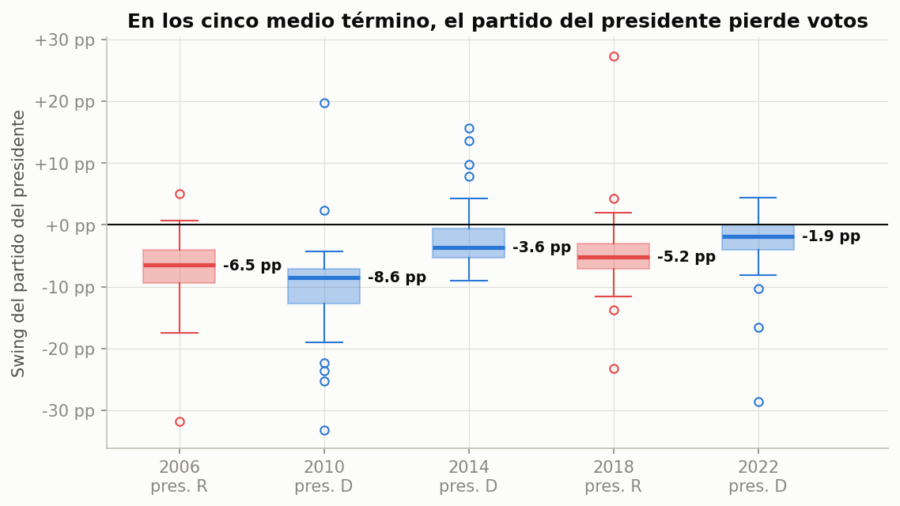

# Predicción de las elecciones de medio término de EE. UU. 2026

Trabajo práctico de **Ciencia de Datos** (2026). El objetivo es predecir el resultado de la
elección de medio término del **3 de noviembre de 2026** en Estados Unidos para la Cámara de
Representantes (435 bancas).

El trabajo sigue el ciclo de vida de un proyecto de ciencia de datos visto en clase:

| Etapa | Estado | Dónde |
|---|---|---|
| 1. Definición del problema, fuentes y construcción del dataset | ✅ Completa | [`fundamentacion_dataset.md`](fundamentacion_dataset.md), [`construir_dataset_midterms.py`](construir_dataset_midterms.py) |
| 2. Preprocesamiento y análisis descriptivo y exploratorio (correlaciones) | ✅ Completa | [`analisis_exploratorio/`](analisis_exploratorio/) |
| 3. Modelo predictivo y estimación de bancas para 2026 | ⏳ Próxima etapa | — |

## Pregunta de investigación

¿Cuánto anticipa el resultado de la elección presidencial anterior (voto a Presidente, voto a la
Cámara y bancas en cada estado) el voto a la Cámara en la elección de medio término siguiente, y
cuánto pierde en ella el partido del presidente?

La variable objetivo principal es `house_dem_share_2p`: la proporción demócrata del voto
bipartidista a la Cámara en cada estado, D / (D + R).

## Datos

**Unidad de análisis:** estado × elección de medio término. Son 50 estados × 6 años (2006, 2010,
2014, 2018, 2022 y 2026) = 300 filas y 42 columnas.

Cada fila une dos elecciones del mismo estado: los **predictores** (columnas `_prev`) salen de la
elección presidencial dos años anterior, y el **resultado**, del medio término. Las filas 2026
(`split = predict`) traen los predictores de 2024 y el resultado vacío.

**Fuentes oficiales:**

- **Federal Election Commission (FEC)** — [Election results and voting information](https://www.fec.gov/introduction-campaign-finance/election-results-and-voting-information/).
  Publicaciones *Federal Elections 2004 a 2022* y *2024 Presidential General Election Results*.
- **Clerk of the U.S. House of Representatives** — [Election Statistics, 1920 to Present](https://history.house.gov/Institution/Election-Statistics/Election-Statistics/).
  *Statistics of the Presidential and Congressional Election of November 5, 2024* (Cámara 2024).

El script valida las 11 elecciones usadas (2004–2024): 435 distritos por año y bancas por partido
iguales a las oficiales. Falla si algo no coincide.

La fundamentación completa (estado del arte, criterios de selección, cómo funciona el script,
limitaciones) está en [`fundamentacion_dataset.md`](fundamentacion_dataset.md). Para leer el
dataset columna por columna, ver el [`GLOSARIO.md`](GLOSARIO.md).

## Estructura del repositorio

```
.
├── README.md                       # este archivo
├── GLOSARIO.md                     # sufijos y significado de cada columna del dataset
├── fundamentacion_dataset.md       # marco teórico, fuentes, construcción y hallazgos
├── construir_dataset_midterms.py   # genera el CSV desde las fuentes primarias
├── dataset_midterms.csv            # dataset final: 300 filas × 42 columnas
├── requirements.txt
└── analisis_exploratorio/
    ├── README.md                   # detalle de cada script, del código y de cada figura
    ├── 01_carga_e_inspeccion.py
    ├── 02_preprocesamiento.py      # Módulo I: limpieza, integración, reducción, discretización
    ├── 03_descriptivo.py           # Módulo II: ¿qué pasó?
    ├── 04_exploratorio.py          # Módulo II: ¿hay patrones? (correlaciones)
    ├── ejecutar_todo.py
    ├── comun.py
    ├── figuras/                    # gráficos generados (PNG)
    └── salidas/                    # tablas generadas (CSV)
```

## Cómo reproducirlo

```bash
python3 -m venv .venv
.venv/bin/pip install -r requirements.txt

# Análisis exploratorio (usa el CSV incluido en el repositorio)
cd analisis_exploratorio
../.venv/bin/python ejecutar_todo.py
```

**Para regenerar el dataset desde cero**, descargá las fuentes primarias en dos carpetas en la
raíz del repositorio y ejecutá `.venv/bin/python construir_dataset_midterms.py`:

| Carpeta | Archivos | Origen |
|---|---|---|
| `excelsMidterms/` | `federalelections2006.xls`, `2010.xls`, `2014.xls`, `2018.xlsx`, `2022.xlsx` | FEC → *Federal Elections* de cada año |
| `excelPres/` | `federalelections2004.xls`, `2008.xls`, `2012.xls`, `2016.xlsx`, `2020.xlsx` | FEC → *Federal Elections* de cada año |
| `excelPres/` | `2024presgeresults.xlsx` | FEC → *2024 Presidential General Election Results* |
| `excelPres/` | `2024election_clerk.pdf` | Clerk de la Cámara → *2024 Election Statistics* |

## Principales hallazgos del análisis exploratorio



1. **El partido del presidente perdió votos en los cinco medio término**, fuera D o R: entre
   −1,9 pp (2022) y −8,6 pp (2010) en el estado mediano, y perdió bancas las cinco veces (de 9 a
   64). Además pierde más en los estados donde estaba más fuerte (r = −0,52).
2. **La presidencial anterior anticipa bien el medio término** (r = 0,76–0,79), y cada vez mejor:
   la correlación con el voto presidencial pasó de 0,68 en 2006–2014 a 0,86 en 2018–2022
   (nacionalización del voto).
3. **Los distritos sin oposición distorsionan las medidas de la Cámara**; en los estados
   disputados, el voto presidencial anterior es el mejor predictor.
4. **Línea base:** voto presidencial anterior + castigo promedio de los otros medio término da un
   error medio de 4,3 pp por estado. Un modelo tiene que superar eso.

Para 2026, con presidente republicano, estos patrones apuntan a un desplazamiento hacia los
demócratas. Correlación no implica causalidad: estos resultados orientan la elección de variables
para el modelo predictivo de la próxima etapa.

## Tecnologías

Python 3.9, pandas, matplotlib, openpyxl y xlrd (lectura de Excel `.xlsx` y `.xls`) y pdfplumber
(lectura del PDF del Clerk).
