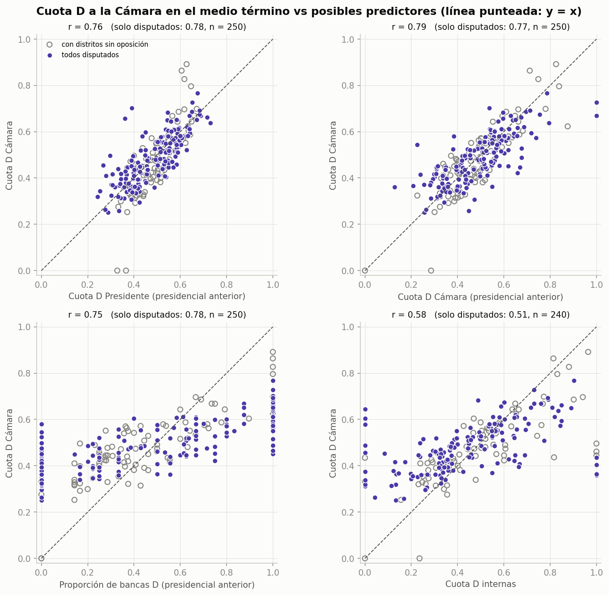
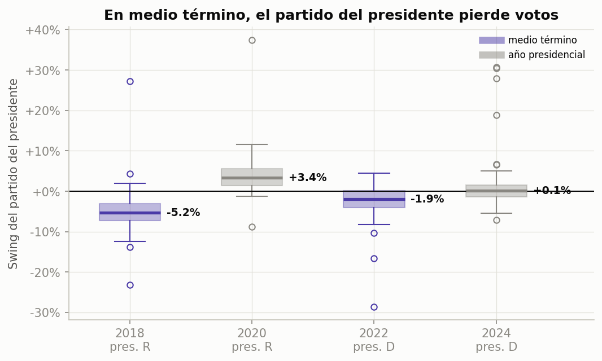

# Predicción de las elecciones de medio término de EE. UU. 2026

Trabajo práctico de **Ciencia de Datos** (2026). El objetivo es predecir el resultado de las
elecciones federales del **3 de noviembre de 2026** en Estados Unidos: la Cámara de
Representantes (435 bancas) y el Senado (35 bancas en juego).

El trabajo sigue el ciclo de vida de un proyecto de ciencia de datos visto en clase:

| Etapa | Estado | Dónde |
|---|---|---|
| 1. Definición del problema, fuentes y construcción del dataset | ✅ Completa | [`fundamentacion_dataset.md`](fundamentacion_dataset.md), [`construir_dataset.py`](construir_dataset.py) |
| 2. Preprocesamiento y análisis descriptivo y exploratorio (correlaciones) | ✅ Completa | [`analisis_exploratorio/`](analisis_exploratorio/) |
| 3. Modelo predictivo y estimación de bancas para 2026 | ⏳ Próxima etapa | — |

## Pregunta de investigación

¿Qué características observables de un estado en elecciones anteriores (su voto presidencial,
su voto a la Cámara en el ciclo previo, su voto al Senado, la participación en internas y el
tipo de ciclo) predicen la proporción de voto demócrata a la Cámara, y cuánto cambia esa
relación en las elecciones de medio término?

La variable objetivo principal es `house_dem_share_2p`: la proporción demócrata del voto
bipartidista a la Cámara en cada estado, D / (D + R).

## Datos

**Unidad de análisis:** estado × año electoral. Son 50 estados × 6 años (2016, 2018, 2020,
2022, 2024 y 2026) = 300 filas y 44 columnas. Las filas 2026 (`split = predict`) traen
completas las variables conocidas antes de la elección y vacías las variables objetivo.

**Fuentes oficiales:**

- **Federal Election Commission (FEC)** — [Election results and voting information](https://www.fec.gov/introduction-campaign-finance/election-results-and-voting-information/).
  Publicaciones *Federal Elections 2016, 2018, 2020 y 2022* y *2024 Presidential General
  Election Results*.
- **Clerk of the U.S. House of Representatives** — [Election Statistics, 1920 to Present](https://history.house.gov/Institution/Election-Statistics/Election-Statistics/).
  *Statistics of the Presidential and Congressional Election of November 5, 2024* (para Cámara
  y Senado 2024, porque el FEC todavía no publicó *Federal Elections 2024*).

El total de bancas por partido reconstruido coincide con las cifras oficiales en los cinco
ciclos (por ejemplo, 2024: 215 D / 220 R). El script falla si no coinciden.

La fundamentación completa (estado del arte, criterios de selección de fuentes y período,
diccionario de datos, limitaciones) está en [`fundamentacion_dataset.md`](fundamentacion_dataset.md).

Para leer el dataset columna por columna (sufijos, conceptos clave y diccionario por grupos con
ejemplos), ver el [`GLOSARIO.md`](GLOSARIO.md).

## Estructura del repositorio

```
.
├── README.md                       # este archivo
├── GLOSARIO.md                     # sufijos y significado de cada columna del dataset
├── fundamentacion_dataset.md       # marco teórico, fuentes, criterios y diccionario de datos
├── construir_dataset.py            # genera el CSV desde las fuentes primarias
├── dataset_elecciones_estado.csv   # dataset final: 300 filas × 44 columnas
├── requirements.txt
└── analisis_exploratorio/
    ├── README.md                   # detalle de cada script y figura
    ├── 01_carga_e_inspeccion.py
    ├── 02_preprocesamiento.py      # Módulo I: limpieza, integración, reducción, discretización
    ├── 03_descriptivo.py           # Módulo II: ¿qué pasó?
    ├── 04_exploratorio.py          # Módulo II: ¿hay patrones? (correlaciones)
    ├── ejecutar_todo.py
    ├── comun.py
    ├── figuras/                    # gráficos generados (PNG)
    └── salidas/                    # tablas generadas (CSV)
```

## Cómo reproducirlo

```bash
python3 -m venv .venv
.venv/bin/pip install -r requirements.txt

# Análisis exploratorio (usa el CSV incluido en el repositorio)
cd analisis_exploratorio
../.venv/bin/python ejecutar_todo.py
```

**Para regenerar el dataset desde cero**, descargá las fuentes primarias en una carpeta
`excelsElecciones/` en la raíz del repositorio y ejecutá `.venv/bin/python construir_dataset.py`:

| Archivo | Origen |
|---|---|
| `federalelections2016.xlsx` … `federalelections2022.xlsx` | FEC → *Federal Elections* de cada año |
| `2024presgeresults.xlsx` | FEC → *2024 Presidential General Election Results* |
| `2024election_clerk.pdf` | Clerk de la Cámara → *2024 Election Statistics* |

## Principales hallazgos del análisis exploratorio



1. **El voto presidencial previo es el mejor predictor** de la cuota demócrata a la Cámara:
   r = 0,88, y 0,95 en los estados donde todos los distritos tuvieron candidato D y R.
   Es consistente con la nacionalización del voto descrita en la literatura.
2. **Los distritos sin candidato opositor son ruido de medición.** Al excluirlos, las
   correlaciones de los predictores principales suben; hay que tratarlos antes de modelar.
3. **El efecto de medio término aparece en el cambio de voto, no en su nivel.** El partido
   del presidente perdió votos en el estado mediano en las dos elecciones de medio término
   del período: −5,2 pp en 2018 (presidente R) y −1,9 pp en 2022 (presidente D). Para 2026,
   con presidente republicano, la teoría predice un desplazamiento hacia los demócratas.
4. **Pocos casos competitivos:** solo 29 de 250 estado-año quedaron entre 48 % y 52 %.



Correlación no implica causalidad: estos resultados orientan la elección de variables para el
modelo predictivo de la próxima etapa.

## Tecnologías

Python 3.9, pandas, matplotlib, openpyxl (lectura de Excel) y pdfplumber (lectura del PDF del
Clerk).
