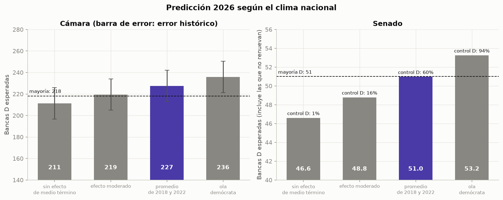

# Modelo predictivo — Elecciones EE. UU. 2026

Scripts en Python + pandas + scikit-learn que entrenan con las elecciones 2018–2024 de
`../dataset_elecciones_estado.csv` y predicen la Cámara y el Senado del 3 de noviembre de 2026.
Continúan la numeración de `../analisis_exploratorio/` y reutilizan su `comun.py` (paleta y
estilo de gráficos).

| Script | Qué hace |
|---|---|
| `05_validacion_cruzada.py` | Compara líneas base y modelos (regresión lineal, Ridge, gradient boosting) dejando un año afuera; elige el modelo de voto a la Cámara |
| `06_curva_votos_bancas.py` | Convierte votos en bancas con una regresión logística por banca y mide el error en bancas nacionales |
| `07_senado.py` | Modelo de la cuota D al Senado; mide el acierto del ganador y el error por estado |
| `08_prediccion_2026.py` | Aplica los modelos a 2026 bajo cuatro escenarios de clima nacional |
| `ejecutar_todo.py` | Corre los cuatro pasos en orden |
| `comun_modelo.py` | Rutas, constantes (mayorías, senadores que no renuevan, mapas nuevos) y funciones compartidas |
| `motor_de_prediccion.py` | Entrena los modelos finales y predice 2026 para cualquier clima nacional; lo usan `08` y el [dashboard](../dashboard/) |

## Cómo correrlo

```bash
pip install -r ../requirements.txt   # solo la primera vez
cd modelo
python ejecutar_todo.py              # o cada script por separado, en orden
```

`08` lee las salidas de `06` y `07`. Igual que en el análisis exploratorio, cada script está
dividido en celdas `# %%` para ejecutarlo como notebook.

## Enfoque

La cuota D de cada estado se separa en dos partes:

```
cuota D del estado = cuota D nacional + inclinación del estado respecto del país
```

- **La inclinación** es estable y se predice con datos previos: el voto presidencial previo y
  el voto a la Cámara del ciclo anterior, ambos relativos al país.
- **La cuota nacional** (el clima nacional) no se puede estimar con estos datos. Solo hay dos
  elecciones de medio término (2018 y 2022), así que en `08` se plantean escenarios.

**Validación:** se deja un año afuera, se entrena con los demás y se predice ese año. Así se
simula predecir una elección que el modelo no vio. Las comparaciones usan la cuota nacional
real del año, así que miden cuán bien se ubica cada estado respecto del país.

## Resultados de la validación (2018–2024)

| Componente | Resultado |
|---|---|
| Voto a la Cámara por estado | 3,08 pp de error medio (regresión lineal) vs 3,52 del swing uniforme. Gradient boosting no mejora |
| Bancas D nacionales (votos previstos → bancas) | ±14,5 bancas de error medio por año |
| Senado | 3,20 pp de error medio; ganador acertado en 110 de 125 elecciones (88 %) |

## Predicción 2026

| Escenario de clima nacional | Cuota D nacional | Cámara: bancas D (mayoría 218) | Senado: bancas D (mayoría 51) | Probabilidad de control D del Senado |
|---|---|---|---|---|
| Sin efecto de medio término (+0) | 48,7 % | 211 (197–226) | 46,6 | 1 % |
| Efecto moderado (+2) | 50,7 % | 219 (205–234) | 48,8 | 16 % |
| **Promedio de 2018 y 2022 (+4,0)** | **52,6 %** | **227 (213–242)** | **50,9** | **60 %** |
| Ola demócrata (+6) | 54,7 % | 236 (221–250) | 53,2 | 94 % |



**Lectura:** la Cámara cambia de mano con un corrimiento nacional de unos 2 puntos hacia los
demócratas. El Senado necesita uno de unos 4 puntos, porque la mayoría de las bancas en juego
están en estados republicanos.

## Limitaciones

- **El clima nacional es un supuesto, no una estimación.** El escenario central sale de solo
  dos casos. Un promedio de la encuesta genérica al Congreso sería el dato externo natural para
  fijarlo.
- **Votos a bancas sin datos por distrito.** La curva usa las bancas del ciclo anterior como
  resumen del mapa. En años de ola tiende a quedarse corta (2018: previó 214 bancas D, fueron
  235). No incorpora los mapas redibujados para 2026 (TX, CA, MO, NC, OH, UT); verificar el
  estado final de cada mapa.
- **Distritos sin oposición.** Siguen siendo la principal fuente de error por estado (SD, ND,
  VT, MA).
- **Senado:** el modelo predice un candidato D genérico. No ve el efecto candidato
  (incumbencia, perfiles moderados como Collins en Maine). En Nebraska compite un independiente
  sin candidato D. El error simulado es independiente entre estados, así que la probabilidad de
  control puede ser más extrema que la real.
